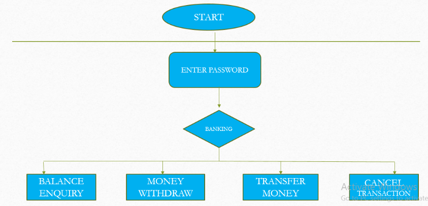

# ATM-Service-Machine-In-Assembly-Language-

The ATM Service is the project which is used to access their bank accounts in order to make cash withdrawals. Whenever the user need to make cash withdraws, they can enter their PIN/PASSWORD (personal identification number) 
And it will display the amount to be withdrawn in the multiples of 500’s. Once their withdrawn was successful, the amount will be debited in their account.
The ATM Service is developed in Assembly language program. Hence we use the software, EMU 8086 MICROPROCESSOR EMULATOR 
The ATM will service one customer at a time. A customer will be required to enter ATM Card number or their respective netbanking password ,personal identification number (PIN) – both of which will be sent to the database for validation as part of each transaction. The customer will then be able to perform one or more transactions. Also customer must be able to make a balance inquiry of their account.

## Modules Involved

    To develop this ATM system the entire operation has been divided into the following step:
     1. Verification process.
     2. service and account selection .
     3. Balance Enquiry.
     4. Money Withdraw.
     5. Transfer Money.
     6. Exit the service.

# ATM Service Machine
The ATM Service is the project which is used to access their bank accounts in order to make cash withdrawals. Whenever the user need to make cash withdraws, they can enter their PIN/PASSWORD (personal identification number) 
And it will display the amount to be withdrawn in the multiples of 500’s. Once their withdrawn was successful, the amount will be debited in their account.
The ATM Service is developed in Assembly language program. Hence we use the software, EMU 8086 MICROPROCESSOR EMULATOR 
The ATM will service one customer at a time. A customer will be required to enter ATM Card number or their respective netbanking password ,personal identification number (PIN) – both of which will be sent to the database for validation as part of each transaction. The customer will then be able to perform one or more transactions. Also customer must be able to make a balance inquiry of their account.

# ATM Service Machine
The ATM Service is the project which is used to access their bank accounts in order to make cash withdrawals. Whenever the user need to make cash withdraws, they can enter their PIN/PASSWORD (personal identification number) 
And it will display the amount to be withdrawn in the multiples of 500’s. Once their withdrawn was successful, the amount will be debited in their account.
The ATM Service is developed in Assembly language program. Hence we use the software, EMU 8086 MICROPROCESSOR EMULATOR 
The ATM will service one customer at a time. A customer will be required to enter ATM Card number or their respective netbanking password ,personal identification number (PIN) – both of which will be sent to the database for validation as part of each transaction. The customer will then be able to perform one or more transactions. Also customer must be able to make a balance inquiry of their account.

## Overview of the project

